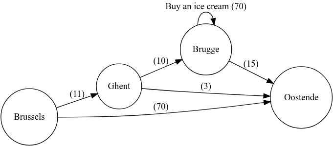

# Examples

## Path finding

Given an initial state and state transitions, find paths within limits

In the example we go from Brussels to Oostende, with the possibility of buying an icecream. 



```sh
>eye --nope --n3 engine/gps-plugin.n3 brussels-ostende/map.n3 brussels-ostende/state.n3 --query brussels-ostende/query.n3
eye --nope --n3 engine/gps-plugin.n3 brussels-ostende/map.n3 brussels-ostende/state.n3 --query brussels-ostende/query.n3
EYE v18.0117.1550 josd
SWI-Prolog 7.6.4 (amd64): , 16:54
starting 37 [msec cputime] 44 [msec walltime]
#Processed by EYE v18.0117.1550 josd
#eye --nope --n3 engine/gps-plugin.n3 brussels-ostende/map.n3 brussels-ostende/state.n3 --query brussels-ostende/query.n3

GET file:///home/cvasquez/github.com/cristianvasquez/n3_playground/engine/gps-plugin.n3 SC=7
GET file:///home/cvasquez/github.com/cristianvasquez/n3_playground/brussels-ostende/map.n3 SC=13
GET file:///home/cvasquez/github.com/cristianvasquez/n3_playground/brussels-ostende/state.n3 SC=2
GET file:///home/cvasquez/github.com/cristianvasquez/n3_playground/brussels-ostende/query.n3 SC=1
networking 11 [msec cputime] 12 [msec walltime]
PREFIX math: <http://www.w3.org/2000/10/swap/math#>
PREFIX list: <http://www.w3.org/2000/10/swap/list#>
PREFIX log: <http://www.w3.org/2000/10/swap/log#>
PREFIX e: <http://eulersharp.sourceforge.net/2003/03swap/log-rules#>
PREFIX gps: <http://josd.github.io/fluid/gps/gps-schema#>
PREFIX : <http://josd.github.io/fluid#>
PREFIX ex: <http://example.org#>

:i1 ex:hasPath ((:drive_Brussels_Oostende) 70.0 0.005 1.0).
:i1 ex:hasPath ((:drive_Brussels_Ghent :drive_Ghent_Brugge :buy_an_icecream :drive_Brugge_Oostende) 106.0 0.02 1.0).
:i1 ex:hasPath ((:drive_Brussels_Ghent :drive_Ghent_Brugge :drive_Brugge_Oostende) 36.0 0.015 1.0).
:i1 ex:hasPath ((:drive_Brussels_Ghent :drive_Ghent_Oostende) 14.0 0.01 1.0).

reasoning 1 [msec cputime] 1 [msec walltime]
#2018-06-28T18:36:27.621Z in=23 out=4 ent=4 step=4 brake=2 inf=94075 sec=0.049 inf/sec=1919898
#ENDS

2018-06-28T18:36:27.621Z in=23 out=4 ent=4 step=4 brake=2 inf=94075 sec=0.049 inf/sec=1919898
```


## Credit

[Fluid](https://github.com/josd/fluid), by Jos

------------------------------
Goal driven Parallel Sequences
------------------------------

Inspired by https://www.cs.cmu.edu/~fp/courses/15816-s12/lectures/01-inference.pdf

In linear logic we are instead concerned with the change of truth with a
change of state. We model this in a very simple way: when an inference rule
is applied we consume the propositions used as premises and produce the
propositions in the conclusions, thereby effecting an overall change in state.
